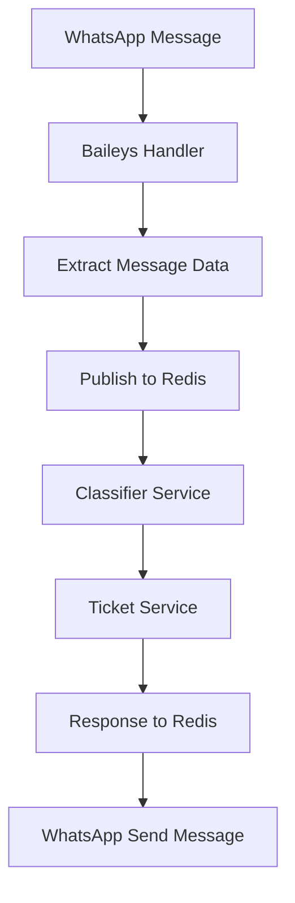

# Documentación Técnica: WhatsApp Service - Guía de Replicación

## 🏗️ Arquitectura General del Sistema

El WhatsApp Service es parte de una **arquitectura de microservicios** que incluye:

1. **whatsapp-service** (Node.js + Baileys) - Manejo de mensajes WhatsApp
2. **classifier-service** (Python FastAPI + LangChain) - Clasificación IA de incidentes  
3. **ticket-service** (Python FastAPI) - Integración con Zoho Desk
4. **Redis** - Message broker y comunicación entre servicios

## 📋 Especificaciones del WhatsApp Service

### Tecnologías Core
```json
{
  "runtime": "Node.js >= 18.0.0",
  "whatsapp_library": "@whiskeysockets/baileys",
  "message_broker": "Redis Pub/Sub",
  "architecture": "Event-driven microservice",
  "containerization": "Docker"
}
```

### Estructura de Directorios
```
whatsapp-service/
├── src/
│   ├── api/                 # Endpoints REST
│   ├── handlers/            # Manejadores de eventos WhatsApp
│   ├── utils/              # Utilidades y helpers
│   ├── index.js            # Punto de entrada
│   └── whatsapp-service.js # Lógica principal del servicio
├── sessions/               # Sesiones WhatsApp (persistencia)
├── logs/                   # Archivos de log
├── .env                    # Variables de entorno
├── Dockerfile             # Configuración Docker
└── package.json           # Dependencias Node.js
```

## 🔧 Dependencias Principales

### package.json
```json
{
  "dependencies": {
    "@whiskeysockets/baileys": "^6.6.0",
    "express": "^4.18.2",
    "redis": "^4.6.0",
    "winston": "^3.11.0",
    "dotenv": "^16.3.1",
    "qrcode-terminal": "^0.12.0",
    "mime-types": "^2.1.35"
  },
  "devDependencies": {
    "jest": "^29.7.0",
    "supertest": "^6.3.3",
    "nodemon": "^3.0.1"
  }
}
```

## 🚀 Configuración de Entorno

### Variables de Entorno (.env)
```bash
# Servicio
PORT=3001
NODE_ENV=development
SERVICE_NAME=whatsapp-service

# Redis
REDIS_URL=redis://localhost:6379
REDIS_CHANNEL_INBOUND=whatsapp:messages:inbound
REDIS_CHANNEL_OUTBOUND=whatsapp:messages:outbound

# WhatsApp
WHATSAPP_SESSION_NAME=support-bot-session
WHATSAPP_PRINT_QR=true
WHATSAPP_MARK_ONLINE=false

# Logging
LOG_LEVEL=info
LOG_FILE=./logs/whatsapp-service.log

# Health Check
HEALTH_CHECK_PORT=3001
```

## 💻 Implementación Core

### 1. Servicio Principal (whatsapp-service.js)
```javascript
const { makeWASocket, DisconnectReason, useMultiFileAuthState } = require('@whiskeysockets/baileys');
const QRCode = require('qrcode-terminal');
const redis = require('redis');
const winston = require('winston');

class WhatsAppService {
    constructor() {
        this.socket = null;
        this.redisClient = null;
        this.logger = this.setupLogger();
        this.sessionPath = './sessions';
    }

    async initialize() {
        // Configurar Redis
        await this.setupRedis();
        
        // Configurar WhatsApp
        await this.setupWhatsApp();
        
        // Configurar manejadores de eventos
        this.setupEventHandlers();
    }

    async setupRedis() {
        this.redisClient = redis.createClient({
            url: process.env.REDIS_URL
        });
        
        await this.redisClient.connect();
        this.logger.info('Redis connected successfully');
    }

    async setupWhatsApp() {
        const { state, saveCreds } = await useMultiFileAuthState(this.sessionPath);
        
        this.socket = makeWASocket({
            auth: state,
            printQRInTerminal: process.env.WHATSAPP_PRINT_QR === 'true',
            logger: this.logger,
            markOnlineOnConnect: process.env.WHATSAPP_MARK_ONLINE === 'true'
        });

        // Guardar credenciales cuando cambien
        this.socket.ev.on('creds.update', saveCreds);
    }

    setupEventHandlers() {
        // Conexión establecida
        this.socket.ev.on('connection.update', this.handleConnection.bind(this));
        
        // Mensajes recibidos
        this.socket.ev.on('messages.upsert', this.handleMessages.bind(this));
        
        // Escuchar mensajes salientes desde Redis
        this.listenForOutboundMessages();
    }

    async handleConnection(update) {
        const { connection, lastDisconnect, qr } = update;
        
        if (qr) {
            QRCode.generate(qr, { small: true });
            this.logger.info('QR Code generated - scan with WhatsApp');
        }
        
        if (connection === 'close') {
            const shouldReconnect = lastDisconnect?.error?.output?.statusCode !== DisconnectReason.loggedOut;
            
            if (shouldReconnect) {
                this.logger.info('Reconnecting to WhatsApp...');
                await this.setupWhatsApp();
            }
        } else if (connection === 'open') {
            this.logger.info('WhatsApp connection established');
        }
    }

    async handleMessages(messageUpdate) {
        const { messages } = messageUpdate;
        
        for (const message of messages) {
            if (message.key.fromMe) continue; // Ignorar mensajes propios
            
            const messageData = this.extractMessageData(message);
            
            // Publicar mensaje a Redis para procesamiento
            await this.publishMessage(messageData);
        }
    }

    extractMessageData(message) {
        return {
            id: message.key.id,
            from_user: message.key.remoteJid,
            text: message.message?.conversation || 
                  message.message?.extendedTextMessage?.text || '',
            timestamp: new Date(message.messageTimestamp * 1000).toISOString(),
            message_type: this.getMessageType(message),
            media_url: null, // Se procesará si hay media
            mentions: message.message?.extendedTextMessage?.contextInfo?.mentionedJid || [],
            quoted_message: message.message?.extendedTextMessage?.contextInfo?.quotedMessage || null
        };
    }

    async publishMessage(messageData) {
        try {
            await this.redisClient.publish(
                process.env.REDIS_CHANNEL_INBOUND,
                JSON.stringify(messageData)
            );
            
            this.logger.info(`Message published to Redis: ${messageData.id}`);
        } catch (error) {
            this.logger.error('Error publishing message to Redis:', error);
        }
    }

    async listenForOutboundMessages() {
        const subscriber = this.redisClient.duplicate();
        await subscriber.connect();
        
        await subscriber.subscribe(process.env.REDIS_CHANNEL_OUTBOUND, (message) => {
            const messageData = JSON.parse(message);
            this.sendMessage(messageData);
        });
    }

    async sendMessage(messageData) {
        try {
            const { to, text, mentions = [] } = messageData;
            
            await this.socket.sendMessage(to, {
                text: text,
                mentions: mentions
            });
            
            this.logger.info(`Message sent to ${to}`);
        } catch (error) {
            this.logger.error('Error sending message:', error);
        }
    }

    setupLogger() {
        return winston.createLogger({
            level: process.env.LOG_LEVEL || 'info',
            format: winston.format.combine(
                winston.format.timestamp(),
                winston.format.json()
            ),
            transports: [
                new winston.transports.Console(),
                new winston.transports.File({ 
                    filename: process.env.LOG_FILE || './logs/whatsapp-service.log' 
                })
            ]
        });
    }
}

module.exports = WhatsAppService;
```

### 2. API REST (api/routes.js)
```javascript
const express = require('express');
const router = express.Router();

// Health check
router.get('/health', (req, res) => {
    res.json({
        status: 'healthy',
        service: 'whatsapp-service',
        timestamp: new Date().toISOString(),
        uptime: process.uptime()
    });
});

// Enviar mensaje
router.post('/send', async (req, res) => {
    try {
        const { to, message, mentions } = req.body;
        
        // Publicar a Redis para envío
        await req.app.locals.redisClient.publish(
            process.env.REDIS_CHANNEL_OUTBOUND,
            JSON.stringify({ to, text: message, mentions })
        );
        
        res.json({ success: true, message: 'Message queued for sending' });
    } catch (error) {
        res.status(500).json({ error: error.message });
    }
});

// Estado de conexión
router.get('/status', (req, res) => {
    const whatsappService = req.app.locals.whatsappService;
    
    res.json({
        connected: whatsappService.socket?.user ? true : false,
        user: whatsappService.socket?.user || null,
        battery: whatsappService.socket?.battery || null
    });
});

module.exports = router;
```

### 3. Punto de Entrada (index.js)
```javascript
require('dotenv').config();
const express = require('express');
const WhatsAppService = require('./whatsapp-service');
const apiRoutes = require('./api/routes');

const app = express();
const port = process.env.PORT || 3001;

app.use(express.json());

async function startServer() {
    try {
        // Inicializar WhatsApp Service
        const whatsappService = new WhatsAppService();
        await whatsappService.initialize();
        
        // Hacer disponible en la app
        app.locals.whatsappService = whatsappService;
        app.locals.redisClient = whatsappService.redisClient;
        
        // Configurar rutas
        app.use('/api', apiRoutes);
        
        // Iniciar servidor
        app.listen(port, () => {
            console.log(`WhatsApp Service running on port ${port}`);
        });
        
    } catch (error) {
        console.error('Error starting WhatsApp Service:', error);
        process.exit(1);
    }
}

// Manejo de señales para cierre limpio
process.on('SIGINT', async () => {
    console.log('Shutting down WhatsApp Service...');
    if (app.locals.whatsappService) {
        await app.locals.whatsappService.redisClient.quit();
    }
    process.exit(0);
});

startServer();
```

## 🐳 Configuración Docker

### Dockerfile
```dockerfile
FROM node:18-alpine

WORKDIR /app

# Instalar dependencias del sistema
RUN apk add --no-cache \
    chromium \
    nss \
    freetype \
    freetype-dev \
    harfbuzz \
    ca-certificates \
    ttf-freefont

# Variables de entorno para Puppeteer
ENV PUPPETEER_SKIP_CHROMIUM_DOWNLOAD=true \
    PUPPETEER_EXECUTABLE_PATH=/usr/bin/chromium-browser

# Copiar archivos de dependencias
COPY package*.json ./

# Instalar dependencias
RUN npm ci --only=production

# Copiar código fuente
COPY src/ ./src/

# Crear directorios necesarios
RUN mkdir -p sessions logs

# Exponer puerto
EXPOSE 3001

# Comando de inicio
CMD ["node", "src/index.js"]
```

## 🔄 Integración con Otros Servicios

### Flujo de Mensajes


### Canales Redis
```javascript
const REDIS_CHANNELS = {
    INBOUND: 'whatsapp:messages:inbound',    // Mensajes recibidos
    OUTBOUND: 'whatsapp:messages:outbound',  // Mensajes a enviar
    NOTIFICATIONS: 'whatsapp:notifications', // Notificaciones del sistema
    STATUS: 'whatsapp:status'                // Estado del servicio
};
```

## 🧪 Testing

### Test de Conexión (tests/connection.test.js)
```javascript
const request = require('supertest');
const app = require('../src/index');

describe('WhatsApp Service', () => {
    test('Health check should return 200', async () => {
        const response = await request(app)
            .get('/api/health')
            .expect(200);
            
        expect(response.body.status).toBe('healthy');
    });
    
    test('Send message endpoint should accept valid data', async () => {
        const messageData = {
            to: '1234567890@s.whatsapp.net',
            message: 'Test message',
            mentions: []
        };
        
        const response = await request(app)
            .post('/api/send')
            .send(messageData)
            .expect(200);
            
        expect(response.body.success).toBe(true);
    });
});
```

## 📊 Monitoreo y Logs

### Estructura de Logs
```javascript
const logFormat = {
    timestamp: '2024-01-29T10:30:00.000Z',
    level: 'info',
    service: 'whatsapp-service',
    event: 'message_received',
    data: {
        message_id: 'msg_123',
        from_user: '1234567890@s.whatsapp.net',
        text_length: 25,
        has_media: false
    }
};
```

## 🚀 Despliegue

### Docker Compose Integration
```yaml
whatsapp-service:
  build: ./services/whatsapp-service
  ports:
    - "3001:3001"
  volumes:
    - ./services/whatsapp-service/sessions:/app/sessions
    - ./services/whatsapp-service/logs:/app/logs
  environment:
    - REDIS_URL=redis://redis:6379
  depends_on:
    - redis
```

## 📋 Checklist de Replicación

Para replicar este servicio en otro proyecto:

1. **✅ Dependencias Node.js**: Instalar Baileys, Redis, Express, Winston
2. **✅ Estructura de Directorios**: Crear src/, sessions/, logs/
3. **✅ Variables de Entorno**: Configurar .env con Redis y WhatsApp settings
4. **✅ Servicio Principal**: Implementar WhatsAppService class
5. **✅ API REST**: Crear endpoints para health, send, status
6. **✅ Manejo de Eventos**: Configurar handlers para conexión y mensajes
7. **✅ Redis Integration**: Pub/Sub para comunicación con otros servicios
8. **✅ Docker**: Configurar Dockerfile y docker-compose
9. **✅ Logging**: Implementar Winston para logs estructurados
10. **✅ Testing**: Crear tests unitarios y de integración

## 🔐 Consideraciones de Seguridad

- **Sesiones WhatsApp**: Encriptar archivos de sesión
- **Variables de Entorno**: Nunca commitear .env files
- **Redis**: Usar autenticación y SSL en producción
- **Rate Limiting**: Implementar límites de mensajes por minuto
- **Validación**: Sanitizar todos los inputs de mensajes

## 📚 Recursos Adicionales

### Documentación de Baileys
- [Baileys GitHub](https://github.com/WhiskeySockets/Baileys)
- [Baileys Documentation](https://whiskeysockets.github.io/Baileys/)

### Redis Pub/Sub
- [Redis Pub/Sub Guide](https://redis.io/docs/manual/pubsub/)
- [Node Redis Client](https://github.com/redis/node-redis)

### Docker Best Practices
- [Node.js Docker Best Practices](https://nodejs.org/en/docs/guides/nodejs-docker-webapp)
- [Multi-stage Docker Builds](https://docs.docker.com/develop/dev-best-practices/)

## 🤝 Contribución

Para contribuir a este servicio:

1. Fork el repositorio
2. Crear rama feature (`git checkout -b feature/nueva-funcionalidad`)
3. Commit cambios (`git commit -m 'Agregar nueva funcionalidad'`)
4. Push a la rama (`git push origin feature/nueva-funcionalidad`)
5. Crear Pull Request

## 📄 Licencia

MIT License - ver archivo LICENSE para detalles

---

**Nota**: Esta documentación está basada en el proyecto WhatsApp Support Bot y proporciona toda la información necesaria para replicar el whatsapp-service en otros proyectos manteniendo la misma arquitectura y funcionalidad.